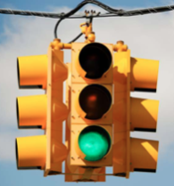
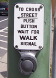
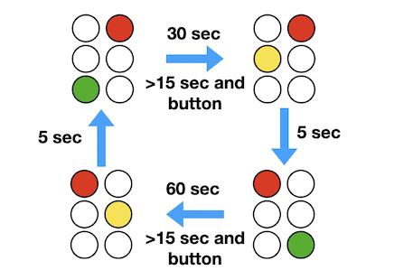

# Project 2 - Event Driven Programming

One challenge in Raft is that there are many different things happening
all at once--messages, timers, concurrency, etc.   To get a better handle
on what might be involved, it can be useful to first look at something
much simpler.   Although not directly related to the Raft algorithm,
the programming techniques worked out here may prove useful in structuring
the project later.

## A Traffic Signal

You have been been tasked with writing the control software for a
traffic signal.  So, let's think about traffic signals for a
moment.  First, there are the lights shown to drivers:



The signal shows a single color in each of four directions.  However, for a
simple signal like this, opposite directions are usually locked together.
Therefore, you can assume that there are just two directions (e.g., NORTH-SOUTH,
and EAST-WEST).  The lights change colors on a timer.

Suppose that the traffic signal also has pedestrian
push buttons to shorten the waiting time. 



Pressing a button makes a green light change to red, but
only if the light has already been green for awhile.

### Operational States

A traffic signal operates by stepping through a specific sequence of
timed states wherein the lights change colors.  However, the
pedestrian button alters the timing of the cycle.  Here's an example
of a possible state cycle:



In this diagram, the light shows green for 30 seconds in one direction
and 60 seconds in the other.  Yellow lights always show for 5 seconds
as the light changes.  Pedestrian buttons shorten the light cycle
time, but lights still must show green for at least 15 seconds before
changing (i.e., pressing the button won't cause the light to instantly
change if it just became green).

Note: The light follows the traffic signal conventions used in the
United States.  There is a yellow (or amber) light that shows as a
light changes from green to red.  However, no yellow light is shown
when a light transitions from red to green.

### Simulated Traffic Light Hardware

In the directory `traffic/` you'll find a file `light.py`.  This implements
simulated traffic light hardware that can be controlled over the network.
Run it as follows:

```
bash $ python3 light.py 10000 11000
I'm a traffic light. Send me colors on port 10000.
Receive button presses by listening on port 11000

    R
  +---+
R |   | R
  +---+
    R

[Type 'ns' or 'ew' for button]
```

In this example, 10000 is a network port number on which the light
receives color change messages, and 11000 is the network port of a
program that receives button press messages.

Now, in a completely separate terminal session, open up an interactive Python
session and send it some messages to change the light color:

```
>>> from socket import socket, AF_INET, SOCK_DGRAM
>>> sock = socket(AF_INET, SOCK_DGRAM)
>>> sock.bind(('localhost', 11000))
>>> sock.sendto(b'NS-G', ('localhost', 10000))
>>>
```

You should see the light color change in the NS direction.  Try sending messages
such as `b'EW-R'`, `b'NS-Y'`, `b'EW-G'`.  Note: the `b'...'` syntax indicates
a byte-string (the light expects to receive messages such as
`b'NS-R'`, `b'NS-Y'`, `b'NS-G'`, `b'EW-R'`, `b'EW-Y'`, and `b'EW-G'`).

If you are using a programming language other than Python, you should
still be able to communicate with the light.  Consult the documentation
to find out how to open a UDP (datagram) socket and use that socket to send
the `'NS-R'`, `'EW-G'`, and similar messages.  The light color should change.

To receive a button press, you need to receive data on the socket
you just created.  For example:

```
>>> sock.recvfrom(100)      # Waits until button is pressed
(b'EW-BUTTON', ('127.0.0.1', 10000))
>>>
```

Typing "ns" or "ew" in the terminal should simulate a
button press and cause a message to be received as shown.

The simulated traffic light hardware has no smarts of its
own.  Thus, you'll need to be careful to make sure your
software doesn't do something like show "green" in both
directions.

### Your Task

Your task is to write the control software and algorithm logic for
the traffic light described in this problem. Specifically, here's the
light configuration:

1. A single East-West light
2. A single North-South light
3. A push button (NS) to change the East-West light from green to red.
4. A push button (EW) to change the North-South light from green to red.

Here are the behaviors that need to be encoded in your solution:

1.  The East-West light stays green for 30 seconds.
2.  The North-South light stays green for 60 seconds. 
3.  Yellow lights always last 5 seconds.
4.  A push-button causes the corresponding light to change immediately
    if it has been green for more than 15 seconds.  If less than 15
    seconds have elapsed, the button press is remembered and the light
    will change once it has been green for 15 seconds.

The final product is to be a single program such as `traffic.py` that
runs the traffic signal.  

### How to Proceed

To solve this problem, it first helps to understand that there are
number of things happening concurrently.  First, there is time
evolution.  So, somehow your controller needs to keep an internal
clock to manage light cycle times.  Second, there are outgoing
messages that need to be sent to lights to change their color.
Finally, there are incoming events (the button press).  These are
unpredictable and may happen at any time.  So, the controller also
needs to watch for this and alter the timing as needed.

A common solution approach is to base the software around the
idea of an event queue or channel.   Essentially, "events" such
as clock ticks and button presses get put onto a queue.   A
centralized control loop then reads these events from the queue
one-by-one and directs the resulting operation of the traffic signal.
Multiple threads may be used to feed events into the queue.

Also, rely on your own experience with traffic signals.  Ultimately,
your code should try to mimic the real world.  If it's working, you
should see the lights and buttons behaving as they do on a real
traffic signal.

## A Note about Coding

You should NOT have to modify the `light.py` program.  Your work
should be solely focused on the `traffic.py` file.  If you are working
in a different language than Python, you should create some kind
equivalent "traffic" program.  Note: in this case, you should **NOT**
have to rewrite the `light.py` program--as long as you can communicate
on the network and run that program, programs written in any language
should be able to communicate with it.

## A Note about Testing

How can you structure the code to make it testable and debuggable?
Is there any way that you can separate the implementation into
components that can be more easily reasoned about?   Part of
the project is about managing complexity.  Making the code testable
is certainly part of that.

